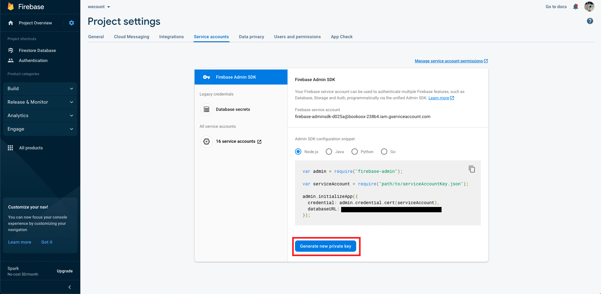

# firebase-boilerplate

Firebase emulator boilerplate repository.


# Feature

- Create Firestore dummy data.
- Setting up a dummy data locale.
- TypeScript Auto Build Tool
- Retain data after emulator shutdown.

# Configuration Settings

## 1. Copy the .firebaserc_example file to create the .firebaserc file.

⚠️ If you only use the emulator, it doesn't matter what `project_id` it is.

Example.

```json
{
  "projects": {
    "default": "[project_id]"
  }
}
```

## 2. Dependency Installation

1. Navigate to the functions folder with the command below.

   `$ cd functions`

2. Install the dependency with the command below.

   `$ npm install`

---

## 🚀 If you want to connect directly to the Firebase, not the emulator, proceed with the process below.

## 3. (Optional) Install the Local Emulator Suite

Before installing the Emulator Suite you will need:

> Node.js version 8.0 or higher.
>
> Java JDK version 11 or higher.

To install the Emulator Suite:

1. Install the Firebase CLI program.

   `$ npm install -g firebase`

2. Set up the Emulator Suite. This command starts a configuration wizard that lets you select emulators of interest, download the corresponding emulator binary files, and set emulator ports if the defaults are not appropriate.

   `$ firebase init emulators`

## 4. (Optional) Copy the .env_example file to create the .env file.

path: `functions/.env`

```
// Projector Database URL
DATABASE_URL="https://[firebase-proejct-id].firebaseio.com"
// Whether to use an emulator
SHOULD_USE_EMULATOR="false"
// Locale when creating dummy data
FAKER_LOCALE="en"
```

The DATABASE_URL can be found in the project settings as shown in the picture below.

Project settings -> Service accounts


## 5. (Optional) Set Project Private Key

1. Download the Private key and rename it `key.json`.

   The project's private key can be downloaded from the project settings as shown in the picture below.

   Project settings -> Service accounts
   

2. Place the key.json file in the directory below.

   path: `functions/src/key.json`

# Usage

All commands are executed under the functions folder.

Use the command below to navigate to the functions subdirectory.
`$ cd functions`

- Running the Emulator

  `$ npm run dev`

- User dummy data generation

  `$ npm run seed`

- Typescript auto build

  `$ npm run dev:seed`
